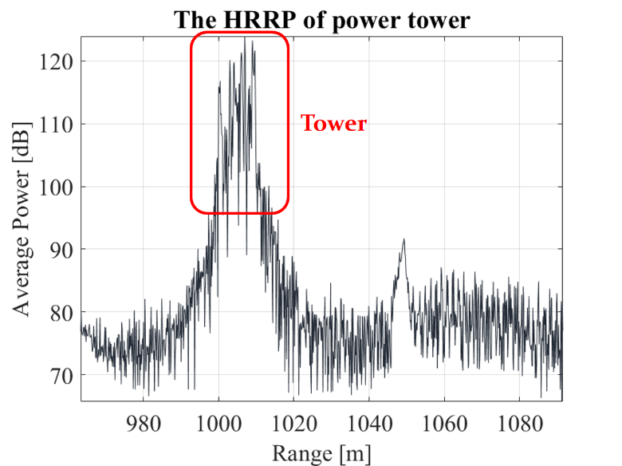

# **High-Resolution, Multi-Frequency and Full-Polarization Radar Database of Small and Group Targets in Clutter Environment**

==**If you find this database useful in your research, please cite: <https://doi.org/10.1007/s11432-023-3889-7>**==

-Meanwhile, in the papers and other publications in which this database is used, it should be stated in the acknowledgement or other suitable places that *the database was obtained by the radar systems developed with the support from **the Special Fund for Research on National Major Research Instruments under Grant 31727901.***

-The ownership of this dataset belongs to the Radar Research Laboratory, Beijing Institute of Technology. Readers are permitted to use this data for research and educational purpose. Proper citation of this dataset is required in papers, reports and other publications. Commercial use of this dataset is strictly prohibited. For any commercial purposes, please contact our team

-If you have any questions in using this database, please contact yanyujia99@zju.edu.cn

## 1. Introduction

​	Detection of small low-altitude targets such as drone swarms, migrating insects and birds is crucial for both military and civilian applications. There exist two main challenges which significantly affect the radar detection and tracking performance. Firstly, weak echo signal of small targets will be buried in strong ground clutter and rain clutter. Meanwhile, the mutual interference among multiple targets will cause missed detections and incorrect track associations. Despite various research efforts in recent years aimed at addressing these two problems, accurate detecting and tracking of weak and dense targets still remains an ongoing challenge for current radar systems.

​	In order to develop detection and tracking techniques, it is essential to analyze the characteristics of target echoes and clutter, wherein real radar data is significant. This data-sharing project aims to provide real data collected by current high-resolution radar systems to support the research and performance assessment of detection and tracking algorithm. Radar clutter and target echoes collected under multiple frequency bands and four different polarizations are available in this database, which can significantly aid the analysis of target and clutter characteristics.

​	A series of low-altitude targets and radar clutter measurement trials were conducted in 2023 at Dongying, Shandong, China. Two distinct radar systems, a high-resolution phased array radar and a multi-frequency fully-polarized radar, were employed to collect data. The available data include radar clutter, migrating insects and birds, as well as drones and drone swarms. This database serves as a fundamental resource for analysis of algorithms concerning weak target detection and tracking within clutter background and in multiple target scenarios.	The rest of this document is organized as follows. Section 2 introduces the data measurement trails. The parameters of radar systems are specified in Section3. Section 4 introduces the data loading method. The detailed list of available data are given in Section 5. Typical data are illustrated in Section 6.

## 2. Overview of Measurement Trials

​	The data measurement trials were conducted in Dongying, Shandong, China. Two radar systems including a high resolution phased array radar and a multi-frequency fully-polarized radar were used to collect clutter and target data. These two radar systems are shown in Fig. 1. The site of radar systems are shown in Fig. 2.

(a) High-resolution phased array radar.

(b) Multi-Frequency Fully-Polarized Radar

Fig. 1 Two radar systems.

Fig. 2 Site of radar systems.

​	The high-resolution phased array radar is a Ku-band stepped frequency radar with a synthetic bandwidth of 1GHz. Its range resolution is around 0.2m with hamming window and its detection range spans from 300m to 2000m. It can operate at staring mode and scanning mode with mechanical scanning at azimuth domain and phased scanning at elevation domain. The high-resolution range profiles are obtained by synthesizing stepped-frequency chirp pulses. Measured data of the phased array radar is consist of four channels, the sum beam, the azimuth difference beam, elevation difference beam and the sidelobe cancellation beam.

​	The multi-frequency fully-polarized radar is designed to operate at X, Ku and Ka band simultaneously with full polarization for each band. It is a mechanical scanning tracking radar system adopting the stepped frequency waveform with a synthetic bandwidth of 1GHz. The multi-frequency fully-polarized radar has the ability to measure angle in both the azimuth and elevation domain at Ka-band based on the amplitude-caparison mono-pulse technique. 

​	In addition to the radar data, auxiliary environment data were also collected to aid analysis. A wind lidar and a temperature and humidity profiler are employed to measure environment conditions including the temperature, humidity, wind direction and wind speed. These two auxiliary environment data acquisition devices are shown in Fig. 3.

(a) Wind lidar.

(b) Temperature and humidity profiler.

Fig. 3 Auxiliary environment data acquisition devices.

### 2.1 Radar Clutter Measurement Trials

​	The available clutter data including ground clutter and rain clutter were collected by high-resolution phased array radar. Ground clutter mainly includes three types of strong clutter: power tower, reservoir and building. The locations of ground scatterers are determined in advance. Their optical images obtained by drones are shown in Fig. 4. The phased array radar operated at staring mode. The elevation angle is fixed to be 2.24°. The observation time is around 10s for each dataset. Note that there may exist non-cooperative targets in the measured data.

​	The rain clutter data were collected when the elevation angle is fixed to be 4.71°, 12.23 and 80.71°, respectively. The weather conditions were also recorded at the same time.

(a) Power tower.

(b) Reservoir.

(c) Buildings.

(d) Buildings.

Fig. 4 Optical images of ground clutter.

Fig. 5

​	The rain clutter data were collected when the elevation angle is fixed to be 4.71°, 12.23° and 80.71°, respectively. The weather conditions were also recorded at the same time.

### 2.2 Migrating insects and birds Observations

​	The migrating insects and birds were observed employing high-resolution phased array radar and multi-frequency fully-polarized radar, respectively. The radar systems locate on one of migratory routes in east China. A huge number of migratory insects and birds will fly across the Bohai Sea to the Yellow River estuary and head south in autumn each year. For instance, the optical image of an observed bird flock is given in Fig. 6.

Fig. 6 The optical image of bird flock.

​	The radar echoes of migrating insects and birds were collected by high-resolution phased array radar in the evening. The available datasets were collected in three different days. The radar is first work in scanning mode to determine the azimuth where there are large quantities of non-cooperating targets. After determining the azimuth angle, the radar was switched to staring mode to collect data. The elevation angle is set to be 8.83°. The observation time is around 10s for each dataset. Auxiliary environment data including the temperature, humidity, wind direction and wind speed are also collected.

​	Migrating insects and birds were also observed by multi-frequency fully-polarized radar. The available data were collected at three different frequency bands and four polarizations. The elevation angle is set to be 10°, 45° and 90°, respectively.

### 2.3 Drone Observations

​	The radar of single drone with uniform motion and uniform acceleration motion were collected by high-resolution phased array radar. The drone used in these experiments is DJI M300, which is shown in Fig. 7. It moved horizontally at three different altitudes. The phased array radar operated at staring mode with azimuth angle fixed to be 259.67°. The drone moved radially along the radar line-of-sight. It has been guaranteed the drone remains within the main beam of radar. The initial position and motion direction of the drone are illustrated in Fig. 8. The distance between the initial position of drone and the phased array radar is around 1815m. The altitude of drone is set to be 90m, 250m and 380m, respectively. The corresponding elevation angle of radar is 2.24°, 7.68° and 11.68°. The real-time kinematic (RTK) measurements of drone are provided to help users determine the real trace of the drone.

Fig. 7 The drone DJI M300 used in the experiments.

Fig. 8 The initial position and motion direction of the drone.

​	The radar echoes of DJI Phantom 4 drone with six different modes of motion were collected by multi-frequency fully-polarized radar. These motion modes include hovering, circling, climbing, radial flying, tangential flying and rapid maneuvering flying. The radar operated at tracking mode.

### 2.4 Drone swarm Observations

​		The surrounding environment of the location of drone swarm observation trails are depicted in Fig. 9. To ensure all the drones in the swarm, the drone swarm flew along a north-south direction in the rectangle region marked in red in the following figure at an altitude of 250m. The makers P1, P2, P4 and P5 denotes the four vertex of the rectangle region. P3 and P6 denotes the points which are closest to the phased array radar on the longer edge of the rectangle region. The detailed position information of the markers P1~P6 are given in Table 1.

Fig. 9 The surrounding environment of the experiment location.

Table 1 Detailed position information of six markers.

| Marker | Azimuth [$^\circ$] | Elevation [$^\circ$] | Distance [m] |
| :----: | :----------------: | :------------------: | :----------: |
|   P1   |      224.536       |        7.678         |    1824.2    |
|   P2   |      227.217       |        7.325         |    1911.4    |
|   P3   |      270.036       |        9.587         |    1438.9    |
|   P4   |      313.019       |     6.877（Min）     |    1964.4    |
|   P5   |      315.603       |        7.200         |    1876.8    |
|   P6   |      270.039       |    10.602（Max）     |    1302.7    |

​	Two kinds of formation for drone swarm, the “I” formation and the “V” formation are adopted in current available data. The drone swarm consists of fifteen drones spaced 2m apart. The motion of the drone swarm included the following stages: taking off, flying in formation around a circle, lateral flying in formation, lasting a total of 8.5 minutes. In the lateral flying stage, the drone swarm flew at a velocity of 10m/s in a straight line to south for 240 seconds. The formations of drone swarm are illustrated in Fig. 10.

(a) “I” formation.

(b) “V” formation.

Fig. 10 Illustration of the formations of drone swarm.

## 3. Specifications of Radar Systems

​	The available data are collected by a high resolution phased array radar and a multi-frequency fully-polarized radar, respectively. Detailed parameters of these two radar systems are given below.

### 3.1 High-Resolution Phased Array Radar

### 3.2 Multi-Frequency Fully-Polarized Radar

## 4. Data Loading Method

The original data files are consist of data head, frame head and the high-resolution range profile data. The data head specifies the type of radar systems, channel and waveform parameters. The frame head includes the exact time and beam direction of each pulse. Detailed contents of data head and frame head are given in appendix. The format of radar data is illustrated in Fig. 11. The data storage protocol is available in the appendix. For the convenience of data loading, a program is provided.

Fig. 11 Format of radar data.

## 5. List of Available Data

### 5.1 High-Resolution Phased Array Radar

- **Data Type: ==Clutter==**

Suggested usage:  Analysis of clutter characteristics and clutter suppression method

| **Description**  | **Remarks**                                                  |
| ---------------- | ------------------------------------------------------------ |
| Ground   clutter | Three datasets. The ground clutter data mainly include three types of strong clutter, the power tower, reservoir and buildings. The elevation angle is 2.24°. |
| Rain   clutter   | Three datasets. The azimuth angle is 230.57° and the elevation angle is 4.70°, 19.73° and 34.70°, respectively. The temperature, wind direction, wind speed and precipitation are also provided. |

- **Data Type:  ==Cooperative Target

| **Description** | **Remarks**                                                  | **Suggested usage**     |
| --------------- | ------------------------------------------------------------ | ----------------------- |
| Single drone    | Six datasets. Uniform motion and uniform acceleration motion at three different altitudes. The azimuth angle is fixed to be 259.67°. The elevation angle is 2.24°,  7.68° and 11.68°. | Weak target detection   |
| Drone swarm     | Two datasets. The drone swarm flying with “I” formation  and “V” formation, respectively. The radar  operated at fast scanning mode. | Group targets tracking. |

- **Data Type:  ==Non-cooperative Target==**

| **Description**   | **Remarks**                                                  | **Suggested usage**   |
| ----------------- | ------------------------------------------------------------ | --------------------- |
| Birds and insects | Three datasets. The available data were collected in three different  evenings. The elevation angle is set to be 8.83°. | Weak target detection |

### 5.2 Multi-Frequency Fully-Polarized Radar

| **Data Type**          | **Description**   | **Remarks**                                                  | **Suggested Usage**                             |
| :--------------------- | :---------------- | ------------------------------------------------------------ | ----------------------------------------------- |
| Cooperative Target     | Single drone      | Six datasets. Six motion modes include hovering, circling, climbing, radial flying, tangential flying and rapid maneuvering flying. | Target detection, manufacturing target tracking |
| Non-cooperative Target | Birds and insects | Three datasets. The azimuth angle is fixed to be 320°. The elevation angle is 10°, 45° and 90°, respectively. | Weak target detection                           |

The naming convention of data files contained in this database is given as follows: **Types-Radar-Detail-Channel(if applicable)**.

**==The detailed links of available data are listed as follows:==**

**High-Resolution Phased Array Radar**
*Radar clutter:
	-Ground clutter: https://pan.baidu.com/s/1wtanMmiUcBUAk3KXwjlUvg?pwd=uhuf (Extracted code: uhuf)

​	-Rain clutter: https://pan.baidu.com/s/1Uipp5qcVPtKNcnlaOZTcIQ?pwd=jkvg (Extracted code: jkvg)

*Cooperative target:

​	-Single drone: https://pan.baidu.com/s/1p-YsyzLRHaxgueLtb6euTA?pwd=3ra5 (Extracted code: 3ra5)

​	-Drone swarm: https://pan.baidu.com/s/1zEeHpnHv0piLrG4ULKCDHA?pwd=ryft (Extracted code: ryft)

*Non-cooperative target:  https://pan.baidu.com/s/1Opl_wKVjl8DG3y7rBQ6GHA?pwd=meck  (Extracted code: meck)

**Multi-Frequency Fully-Polarized Radar**

*Cooperative target: https://pan.baidu.com/s/1flGiN05jzfGohaId1yKxHA?pwd=h98y (Extracted code: h98y)

*Non-cooperative target: https://pan.baidu.com/s/1yNjz0Tfaoxt_bdQjHADRrg?pwd=b3ne  (Extracted code: b3ne)

*Data loading codes are available in: https://github.com/YJYan99/yjyan99.github.io

Users can change the ‘file path’ and run the code to load data to MATLAB workspace.

## 6. Illustration of Typical Data

Illumination of typical data are given in Fig. 12.

(a). The HRRP of ground clutter.

(b) The range-Doppler diagram of observed rain clutter.

(c) The range-Doppler diagram of observed migrating insects and birds.

(d) Single drone with uniform acceleration motion. The range-time-intensity diagram of radar echoes.

(e) Single drone with rapid maneuvering flying observed by multi-frequency fully-polarized radar.

(f) Detection result of drone swarm with “V” formation.

Fig. 12 Illustration of typical data.

